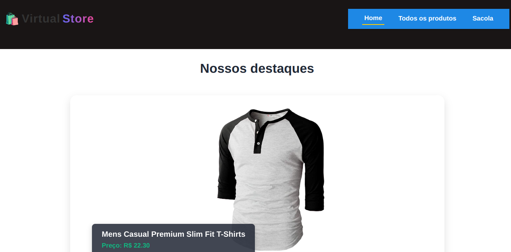
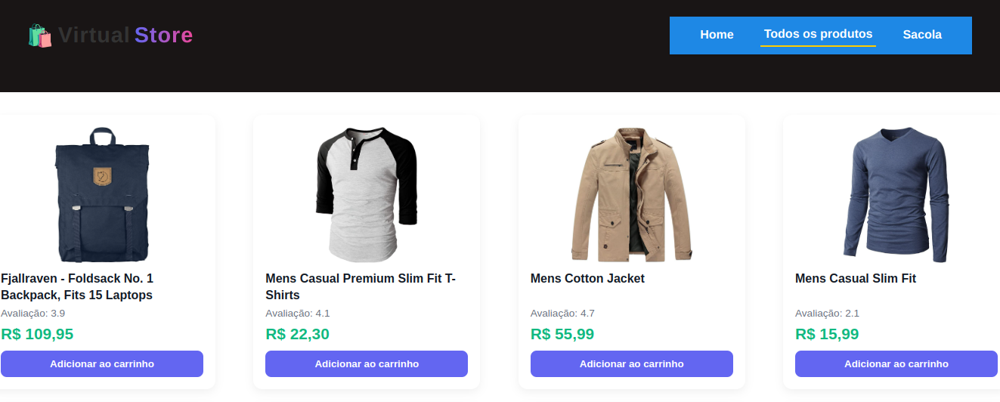
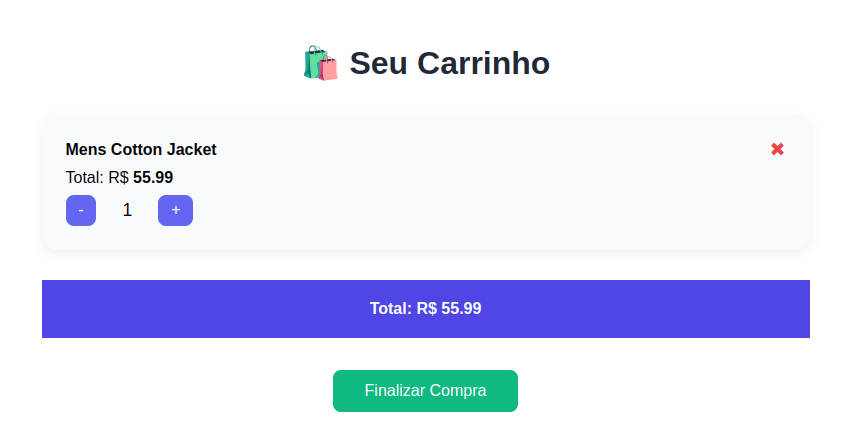

# 🛍️ Virtual Store

Aplicação web desenvolvida em React que simula uma loja virtual consumindo a Fake Store API. Conta com funcionalidades de listagem de produtos, visualização detalhada, carrinho de compras, controle de quantidade e finalização de pedido.

## 🚀 Funcionalidades

- 🔎 Listagem de Produtos com avaliação e preço

- 📄 Página de Detalhes com descrição, imagem e avaliação

- 🛒 Carrinho de Compras

- Adicionar/remover itens

- Aumentar/diminuir quantidade

- Cálculo de valor total

- ✅ Finalizar Compra (simulado com envio de dados para Fake Store API)

- 💬 Feedback visual após adicionar um item ao carrinho

- 🎯 Design Responsivo e visual moderno

## 📦 Tecnologias utilizadas

- React

- React Router DOM

- Fake Store API

- CSS Modules

## 📸 Demonstração

## Instale as dependências

npm install

## Execute a aplicação

npm start
Acesse em: http://localhost:3000

## 📌 Observações

Os usuários e pedidos são simulados, já que a Fake Store API não exige autenticação real para cadastro ou finalização de pedidos, mas foi inplementado um login fake com um usuário padrão.

O estado global do carrinho é controlado via Context API.
